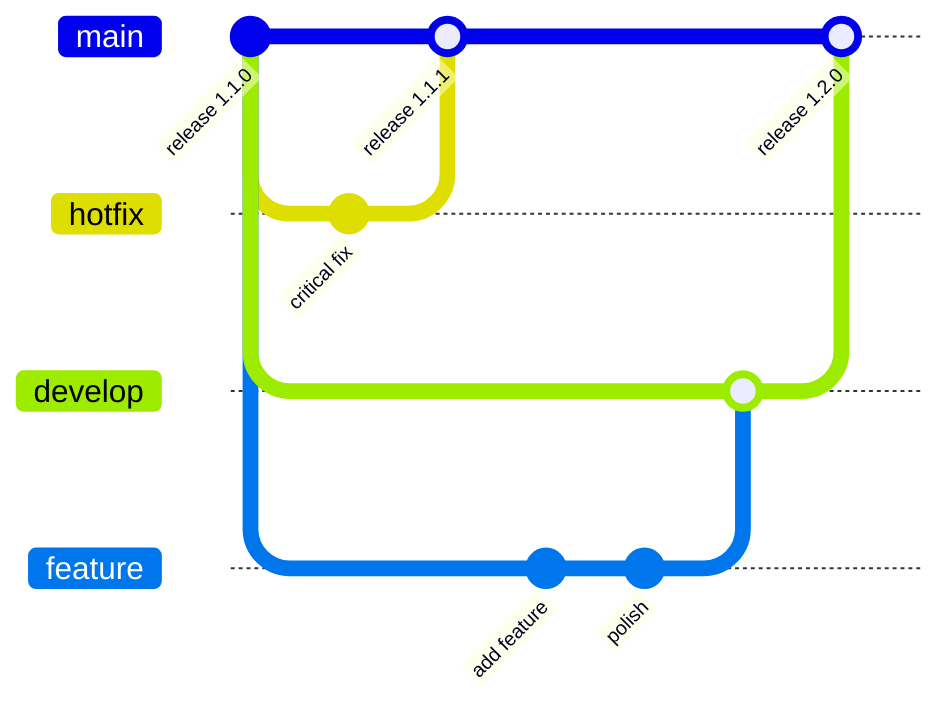

# GitHub Flow

## Branches

| Branch    | Purpose                             |
| --------- | ----------------------------------- |
| `main`    | Live production app                 |
| `develop` | Integration branch for all new work |

## Rules

- All branches are PR-only — no direct pushes to `main` or `develop`
- All feature work and non-urgent fixes target `develop`
- Hotfixes PR directly into `main`

## Flow

## CI Automation

1. **Merge feature PR into `develop`** → CI opens a release PR: `develop → main`
2. **Merge release PR into `main`** → CI releases the app (bumps version,
   builds, deploys)
3. **After release** → CI recreates `develop` from `main` (clean slate, no
   drift)

---

**See also:** [Deployment](Deployment)
